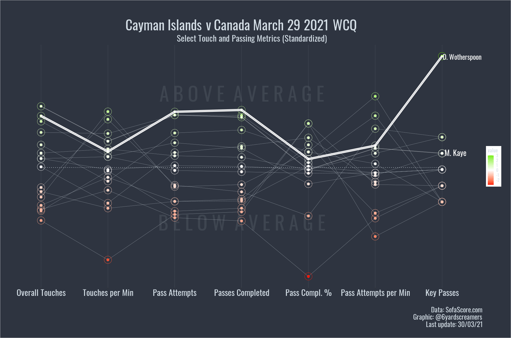

<!--more-->

what if I write something here **blog**

> what if i write this in a block quote

### big letters

<!-- this is how to comment out-->

{} <!-- this is the short quick way and below is the embed direct from the tweet-->

<blockquote class="twitter-tweet">
1/3 A look at Google Trends data for Alphonso Davies in Canada and Worldwide over the last 5 years. Yeah &#39;That Goal&#39; made waves, especially at home🇨🇦⚡️. <a href="https://twitter.com/hashtag/CanMNT?src=hash&amp;ref_src=twsrc%5Etfw">#CanMNT</a> <a href="https://twitter.com/hashtag/WCQ?src=hash&amp;ref_src=twsrc%5Etfw">#WCQ</a> <a href="https://twitter.com/hashtag/AD19?src=hash&amp;ref_src=twsrc%5Etfw">#AD19</a> <a href="https://twitter.com/hashtag/rstats?src=hash&amp;ref_src=twsrc%5Etfw">#rstats</a>🧵Thread below 👇 <a href="https://t.co/IqNGnzYrp4">pic.twitter.com/IqNGnzYrp4</a>
&mdash; Christina (@6yardscreamers) <a href="https://twitter.com/6yardscreamers/status/1459187761676754953?ref_src=twsrc%5Etfw">November 12, 2021</a></blockquote> 

